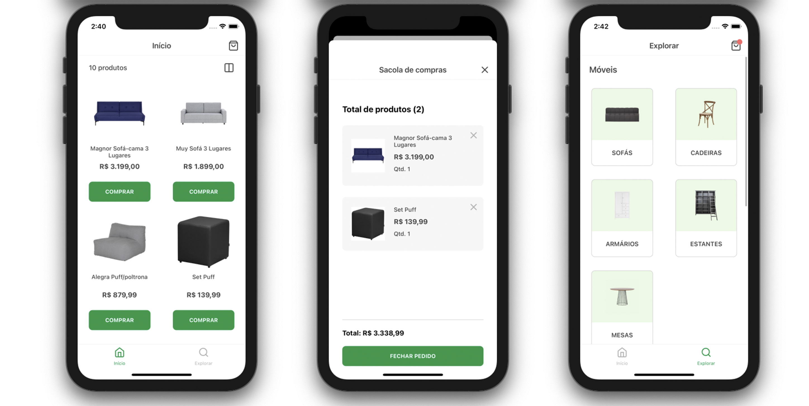

  
  <h3 align="center">Stok Tok</h3>

---

Stok Tok. A maneira mais rápida e fácil de encontrar móveis no seu celular. Encontre os móveis e acessórios utilizando a API da Tok&Stok.

## Architecture

O app Stok Tok foi construído para funcionar com iOS, Android, Web e PWA. Ele usa [Expo](https://expo.io/) como uma biblioteca central para construir e distribuir para todas as plataformas.

### Libs

- [TypeScript](https://www.typescriptlang.org/)
- [react-navigation](https://github.com/react-navigation/react-navigation)
- [react-native-web](https://github.com/necolas/react-native-web)
- [react-native-responsive-dimensions](https://github.com/react-native-toolkit/react-native-responsive-dimensions#readme)

### APIs

- [Tok&Stok](https://www.tokstok.com.br/)

## Testando versão de produção no celular

Você pode baixar o aplicativo em [Expo app](https://expo.io/@murillo94/stok-tok) ou escanear o código QR abaixo para abrir o projeto no Android e iOS se você já tiver o aplicativo da Expo Go:

## Testando versão de produção na web

Você pode clicar [aqui](https://stok-tok.vercel.app/) para verificar o app funcionando na web. Se você quiser usar o aplicativo como PWA, vá até o navegador de configurações em seu celular e faça o download.

## Rodando local

Como outros projetos, você precisará de alguns requisitos para executar:

#### Requisitos

- [Node.js](https://nodejs.org/) (latest)
- [Expo](https://expo.io/) (latest)
- [Yarn](https://yarnpkg.com/) (latest)

#### Como rodar

- `git clone git@github.com:murillo94/stok-tok.git`
- `yarn install`

Agora, você pode escolher um comando para executar o projeto:

- `yarn ios` para rodar no simulador iOS
- `yarn android` para rodar no simulador Android
- `yarn web` para rodar no navegador web

## Fazendo deploy

O Expo oferece formas simples de construir e implantar seu aplicativo com comandos individuais:

### Web

A implantação da web funciona a partir [destes passos](https://docs.expo.io/distribution/publishing-websites/#vercel) e o deploy ocorre localmente usando [Vercel](http://vercel.com/).

### iOS e Android

O deploy do aplicativo é executado no CI e os comandos são armazenados em um arquivo `yaml`, verifique [aqui](./.github/workflows/publish.yml)

## Contribuindo

Qualquer relatório de bug, solicitação de recursos e outras contribuições são mais do que bem-vindos!  
Sempre que possível, por favor, faça um pedido com a implementação em vez de apenas solicitá-la.

Se a `feature` for grande, abra um assunto primeiro para discussão.

## License

MIT, veja o [LICENSE](./LICENSE.md) arquivo.
